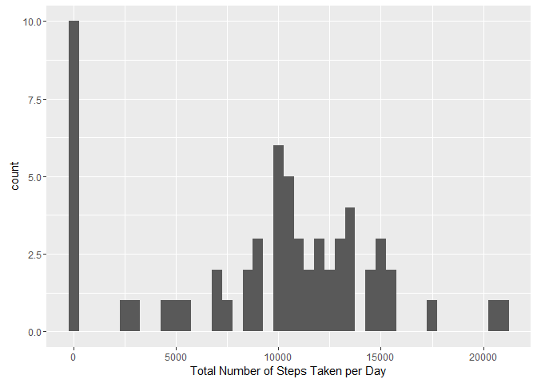
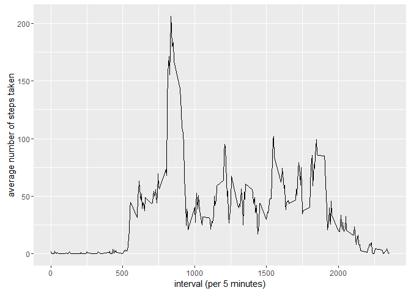
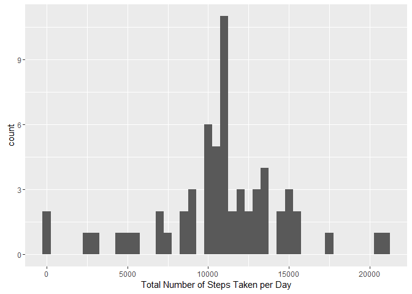
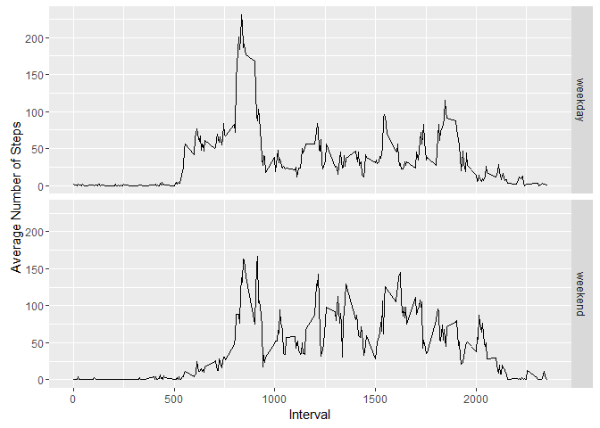

# Reproducible Research: Peer Assessment 1


## Loading and preprocessing the data

```r
unzip(zipfile = "activity.zip")
dat <- read.csv("activity.csv")
library(ggplot2)
```

## What is mean total number of steps taken per day?
* Histogram of the result

```r
TotalSteps <- tapply(dat$steps, dat$date, FUN=sum, na.rm = TRUE)

qplot(TotalSteps, binwidth=500, xlab = "Total Number of Steps Taken per Day")
```

<!-- -->

* Mean and Median

```r
paste("Mean =",mean(TotalSteps, na.rm = TRUE)) 
```

```
## [1] "Mean = 9354.22950819672"
```

```r
paste("Median =",median(TotalSteps, na.rm = TRUE))
```

```
## [1] "Median = 10395"
```

## What is the average daily activity pattern?
* Plot the average steps of each 5-minute interval

```r
AvgInterval <- aggregate(steps ~ interval, dat, mean)
ggplot(data = AvgInterval, aes(x = interval, y = steps)) + geom_line() + xlab("interval (per 5 minutes)") + 
    ylab("average number of steps taken")
```

<!-- -->

* The interval that contain the maximum number of steps

```r
AvgInterval[which.max(AvgInterval$steps),]
```

```
##     interval    steps
## 104      835 206.1698
```


## Imputing missing values

```r
paste("Total number of missing values =",sum(is.na(dat$steps)))
```

```
## [1] "Total number of missing values = 2304"
```
* Fill the missing value with the average steps of the interval and create a new dataset

```r
names(AvgInterval)<-c("interval","meanSteps")
datFilled <- merge(dat, AvgInterval, by = "interval", sort=FALSE)
datFilled$steps[is.na(datFilled$steps)] <- datFilled$meanSteps[is.na(datFilled$steps)]
datFilled <- datFilled[,c("steps","date","interval")]
```

* Histogram the new filled data

```r
TotalStepsFilled <- tapply(datFilled$steps, datFilled$date, FUN=sum)
qplot(TotalStepsFilled, binwidth = 500, xlab = "Total Number of Steps Taken per Day")
```

<!-- -->

* Mean and Median of the new filled data

```r
paste("Mean =",mean(TotalStepsFilled)) 
```

```
## [1] "Mean = 10766.1886792453"
```

```r
paste("Median =",median(TotalStepsFilled))
```

```
## [1] "Median = 10766.1886792453"
```
Obviously, the Mean and median values changed, and the imputing increase both of the them. 


## Are there differences in activity patterns between weekdays and weekends?

* Create column to indicate weekend or weekday

```r
DefineWeekday <- function(x) {
        if (x %in% c("Monday","Tuesday", "Wednesday", "Thursday", "Friday")) return("weekday")
        else if (x %in% c("Saturday","Sunday")) return("weekend")
        else stop("invalid date")
}

datFilled$weekdays <- weekdays(as.Date(datFilled$date))
datFilled$weekdays <- sapply(datFilled$weekdays,FUN = DefineWeekday)
```

* Plot the average steps data of 5-min interval by weekdays or weekends.

```r
AvgWeedaysInterval <- aggregate(steps ~ interval + weekdays, data = datFilled, mean)
ggplot(AvgWeedaysInterval, aes(interval, steps))+geom_line()+facet_grid(weekdays ~ .)+xlab("Interval")+ylab("Average Number of Steps")
```

<!-- -->

